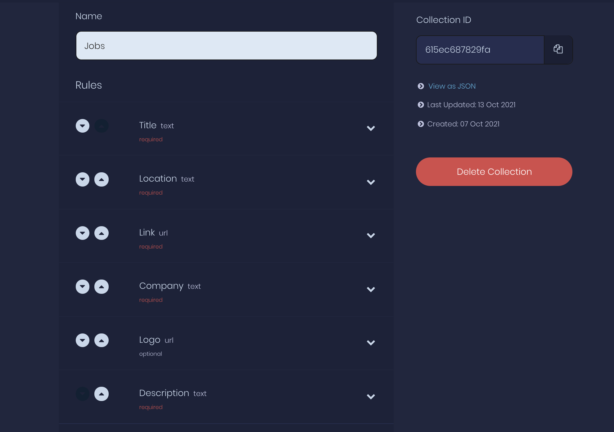

# 🔖 Job Portal with Apple (Swift UI)

A simple Job Portal App built with Swift UI and Appwrite

## 🎬 Getting Started

### 🤘 Install Appwrite 
Follow our simple [Installation Guide](https://appwrite.io/docs/installation) to get Appwrite up and running in no time. You can either deploy Appwrite on your local machine or, on any cloud provider of your choice. 

> Note: If you setup Appwrite on your local machine, you will need to create a public IP so that your hosted frontend can access it.
  
We need to make a few configuration changes to your Appwrite server. 

1. Add a new Apple App (iOS) in Appwrite and enter application id of your application (`io.appwrite.jobportal` etc)
2. Create a new collection with the following rules

Also set the read permission to `*` so that anyone can read. You can also add few documents to display in the app.

### 🚀 Run the Application

3. Open the project in XCode
4. Update `AppwriteService.swift` with your `endpoint` and `project_id` 
5. In `JobsViewModel` update the collection ID with your collection id created in step 2
6. Run

## 🤕 Support

If you get stuck anywhere, hop onto one of our [support channels in discord](https://appwrite.io/discord) and we'd be delighted to help you out 🤝
 